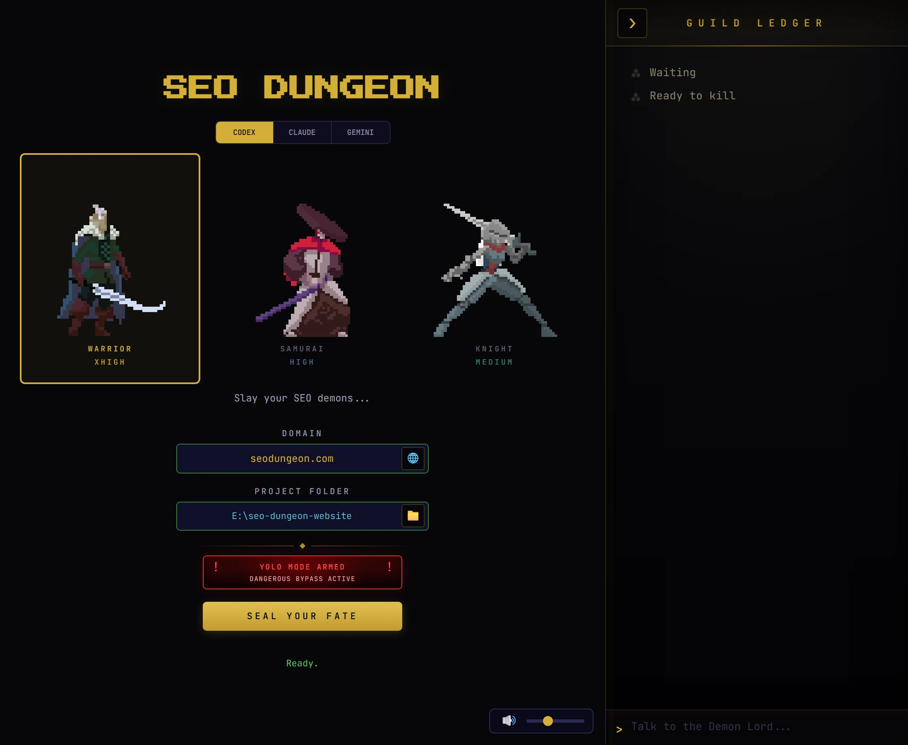
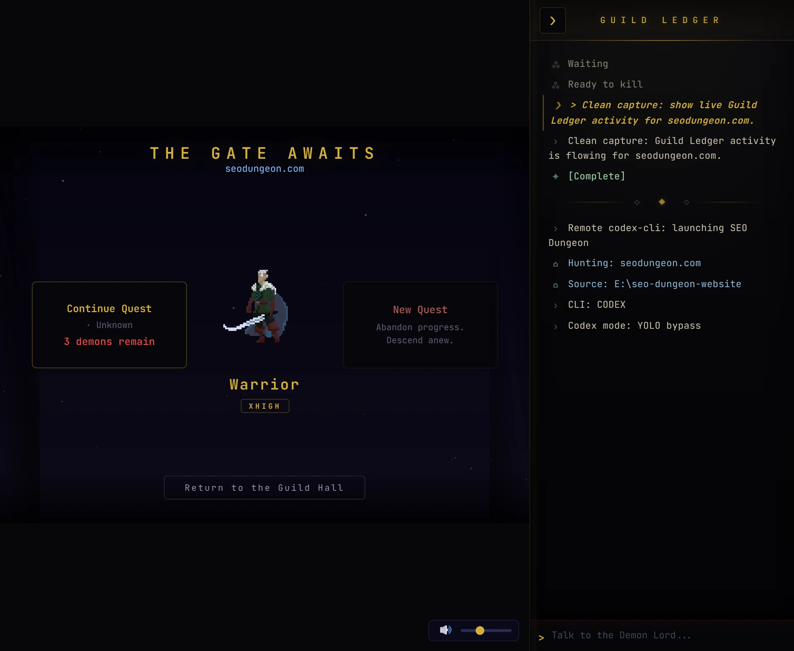
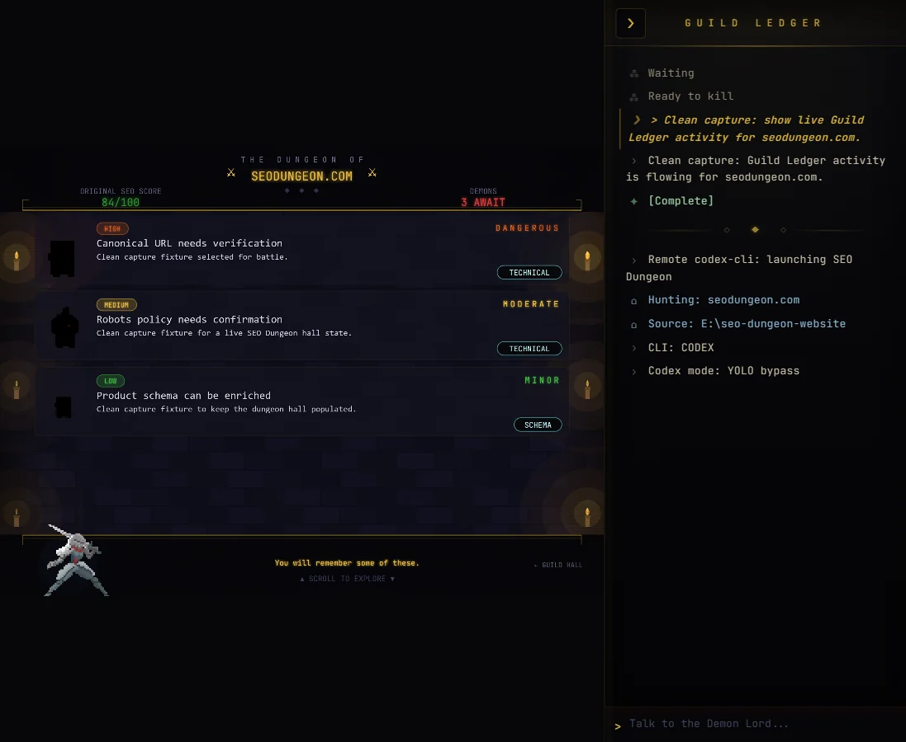
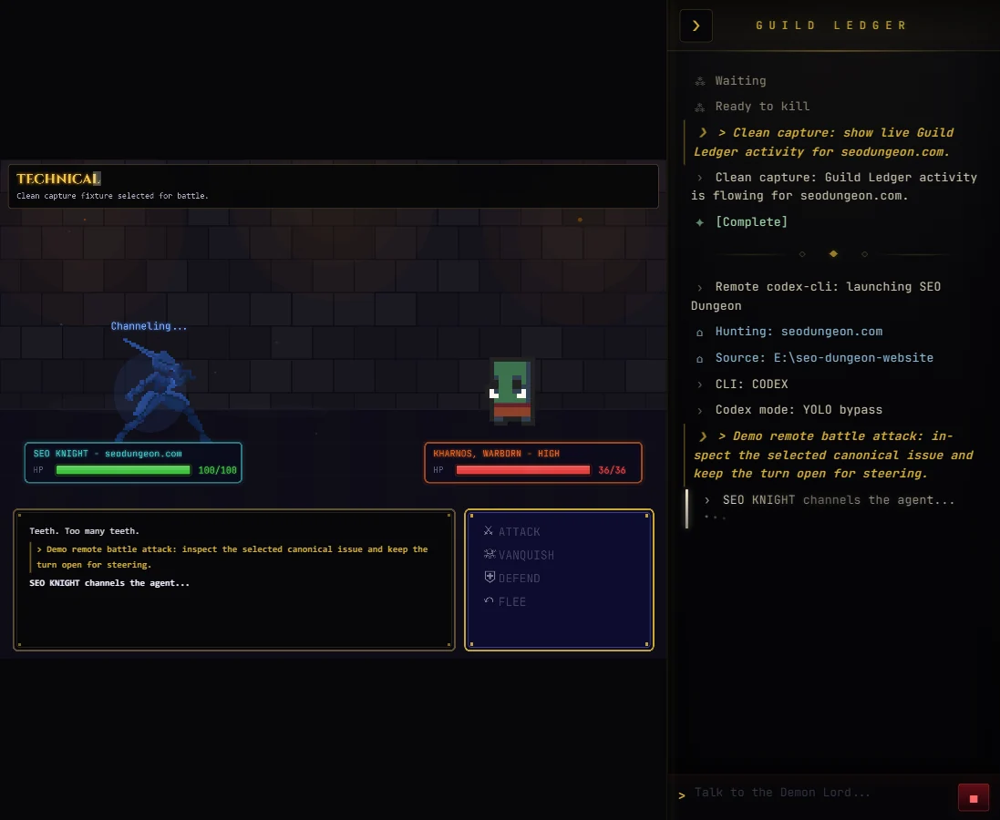

<p align="center">
  <a href="https://raw.githubusercontent.com/avalonreset/seo-dungeon/main/assets/banner.webp"></a>
</p>

# SEO Dungeon - Codex SEO Audit Game

[](https://github.com/avalonreset/seo-dungeon/actions/workflows/ci.yml)
[](LICENSE)
[](CHANGELOG.md)
[](install.sh)

SEO Dungeon turns SEO audits into a 16-bit dungeon crawler. Enter a domain,
inspect the issues as demons, and use Codex to analyze or fix them inside your
local project. It is designed around the Codex CLI and your existing local
development environment.

## Screenshots

<table>
<tr>
<td width="50%"><a href="https://raw.githubusercontent.com/avalonreset/seo-dungeon/main/screenshots/title-screen.webp"></a><br><em>Pick your warrior, enter a domain, seal your fate</em></td>
<td width="50%"><a href="https://raw.githubusercontent.com/avalonreset/seo-dungeon/main/screenshots/gate-scene-full.webp"></a><br><em>Continue a previous quest or begin a new one</em></td>
</tr>
<tr>
<td width="50%"><a href="https://raw.githubusercontent.com/avalonreset/seo-dungeon/main/screenshots/dungeon-hall.webp"></a><br><em>Browse SEO demons sorted by severity</em></td>
<td width="50%"><a href="https://raw.githubusercontent.com/avalonreset/seo-dungeon/main/screenshots/battle-scene.webp"></a><br><em>Battle demons with Codex-powered fixes</em></td>
</tr>
</table>

## How It Works

1. Choose a character. Character selection is visual; Codex uses your configured
   Codex model, or `SEO_DUNGEON_CODEX_MODEL` when set.
2. Enter a domain and local project path.
3. Run a full SEO audit through Codex.
4. Review SEO issues as dungeon demons sorted by severity.
5. Use **Attack** to send a scoped Codex turn for the selected issue.
6. Use **Vanquish** when you decide the issue is handled.

The actual work happens through `codex exec --json` in your local environment.
SEO Dungeon does not proxy model access and does not route through any non-Codex
runtime.

## SEO Engine

The bundled engine has 24 sub-skills and 23 Codex agent profiles:

| Area | Coverage |
|------|----------|
| Audit | Full-site audits, page audits, technical SEO, schema, sitemap, image SEO |
| Content | E-E-A-T, content briefs, semantic clustering, SXO, competitor pages |
| Growth | Local SEO, maps intelligence, backlinks, e-commerce, programmatic SEO |
| Monitoring | SEO drift baselines and comparisons |
| Data | Google SEO APIs, DataForSEO, Firecrawl extension support |
| Framework | FLOW prompts for Find, Leverage, Optimize, Win, and local workflows |

## Quick Start

### Prerequisites

- Node.js 18+
- Python 3.10+
- Codex CLI installed and signed in through the supported subscription path
- Git

### Install Codex Skills

```powershell
# Windows
.\install.ps1
```

```bash
# macOS/Linux
bash install.sh
```

### Run The Game

```bash
cd dungeon
npm install
npm run dev
```

Open [http://localhost:3000](http://localhost:3000). The bridge server starts on
port `3001`.

Runtime environment:

```powershell
# Optional: choose the Codex model used by codex exec
$env:SEO_DUNGEON_CODEX_MODEL='gpt-5.1'
npm run dev
```

First audits can take 5-10 minutes because the `/seo audit` skill fans out many
tool calls. Cached audits are much faster.

## Commands

| Command | What it does |
|---------|-------------|
| `/seo audit <url>` | Full website audit |
| `/seo page <url>` | Deep single-page analysis |
| `/seo technical <url>` | Technical SEO audit |
| `/seo content <url>` | E-E-A-T and content quality |
| `/seo schema <url>` | Schema.org detection and generation |
| `/seo sitemap <url>` | XML sitemap analysis or generation |
| `/seo images <url>` | Image SEO analysis |
| `/seo geo <url>` | AI search readiness |
| `/seo plan <type>` | Strategic SEO planning |
| `/seo cluster <keyword>` | Semantic clustering |
| `/seo sxo <url>` | Search experience optimization |
| `/seo drift baseline <url>` | Capture drift baseline |
| `/seo drift compare <url>` | Compare against drift baseline |
| `/seo ecommerce <url>` | E-commerce SEO |
| `/seo programmatic [url]` | Programmatic SEO |
| `/seo competitor-pages [url]` | Competitor comparison pages |
| `/seo local <url>` | Local SEO |
| `/seo maps [cmd] [args]` | Maps intelligence |
| `/seo hreflang <url>` | International SEO |
| `/seo google [cmd] [url]` | Google SEO APIs |
| `/seo backlinks <url>` | Backlink analysis |
| `/seo dataforseo [cmd]` | DataForSEO extension |
| `/seo firecrawl [cmd] <url>` | Firecrawl extension |

## Architecture

```
seo-dungeon/
  dungeon/                         # Phaser game and WebSocket bridge
    server/index.js                # Codex-only bridge
    src/scenes/                    # Game scenes
    src/utils/                     # Sound, WebSocket client, colors, particles
  skills/                          # SEO engine skills
  agents-codex/                    # Codex TOML agent profiles
  scripts/                         # Python SEO scripts
  extensions/                      # Optional SEO data/crawl add-ons
```

## Troubleshooting

| Problem | Fix |
|---------|-----|
| "The dungeon is unreachable" | Bridge server is not running. Run `npm run server` in `dungeon/`. |
| Skills not found by Codex | Run `install.ps1` or `install.sh` from the repo root. |
| Codex fails to spawn | Confirm `codex` is installed, signed in, and available on `PATH`. |
| Audit takes a long time | Normal for first full-site audits. Use cached audits when available. |
| Google API commands fail | Run `/seo google` for setup instructions. |
| Drift baseline not found | Run `/seo drift baseline <url>` before `/seo drift compare <url>`. |

## Asset Credits

| Asset | Creator | License | Source |
|-------|---------|---------|--------|
| DungeonTileset II | 0x72 | CC0 | [itch.io](https://0x72.itch.io/dungeontileset-ii) |
| Medieval Warrior Pack | LuizMelo | Free for personal and commercial use | [itch.io](https://luizmelo.itch.io/medieval-warrior-pack-2) |
| Martial Hero Pack | LuizMelo | Free for personal and commercial use | [itch.io](https://luizmelo.itch.io/martial-hero) |
| RPG GUI Construction Kit v1.0 | Lamoot | CC-BY 3.0 | [OpenGameArt](https://opengameart.org/content/rpg-gui-construction-kit-v10) |
| Golden UI | Buch | CC0 | [OpenGameArt](https://opengameart.org/content/golden-ui) |

## License

[MIT](LICENSE) - Copyright (c) 2026 Avalon Reset.

SEO engine code is derived from Daniel Agrici's open-source SEO skill suite and
used under the MIT license. SEO Dungeon is independent and Codex-only.
